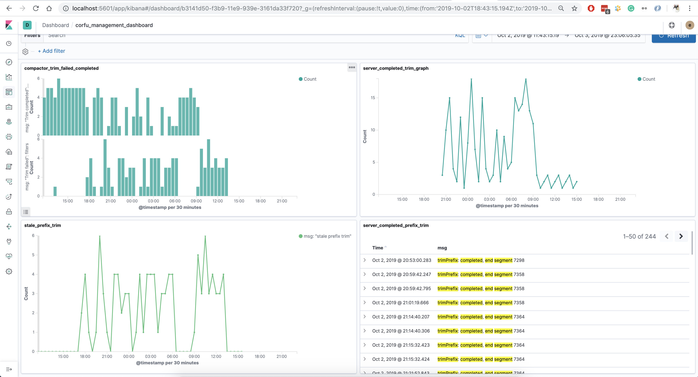
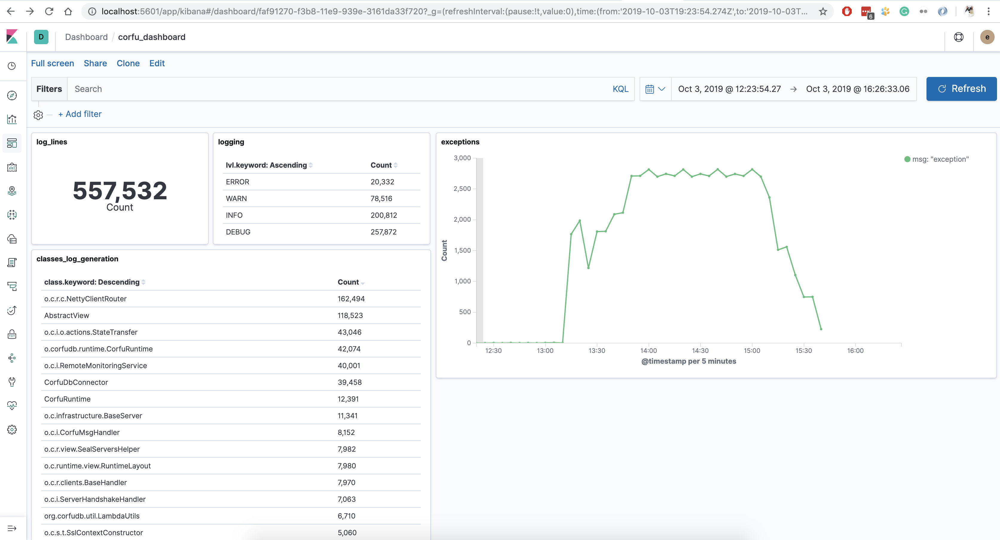

## The Log Aggregation Platform

The Corfu log aggregation platform built on top of [the ELK Stack](https://www.elastic.co/what-is/elk-stack).

**What is the ELK Stack?** "ELK" is the acronym for three open source projects: Elasticsearch, Logstash, and Kibana.
- Elasticsearch is a search and analytics engine.
- Logstash is a server‑side data processing pipeline that ingests data from multiple sources simultaneously,
  transforms it, and then sends it to a "stash" like Elasticsearch.
- Kibana lets users visualize data from Elasticsearch with charts and graphs.

### The platform features
- Automation tools to download, unpack and load the log data from log archives.
- Fast requests, a query language and visualization dashboards, provide high quality user experience.
- A scalable solution that can be extended and customized, highly automated.

### Visualization
Kibana provides powerful and flexible UI and QueryEngine.

Basic Kibana UI :

Kibana multiple filters with custom date range

### Corfu Dashboards
- The corfu management dashboard - contains visual components that show the corfu cluster state.
  Right now it contains information about failed and successful trimming operations
  on the server and compactor sides.

- The corfu common dashboard - provides common information about the corfu cluster,
  like the total amount of log lines, how many records on each log level,
  how much of the log data is generated by the classes, total number of exceptions in the log.

Authors:
- **Viacheslav Petc**
- **Pavel Zaytsev**