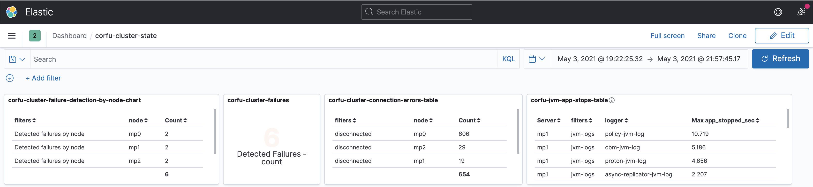
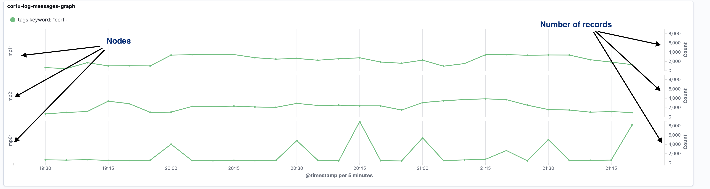
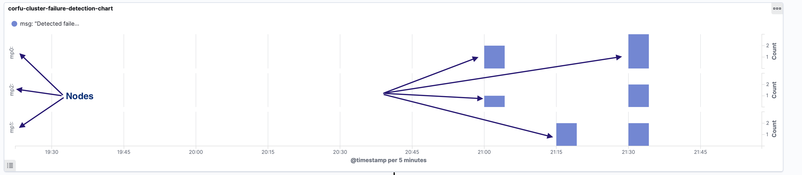
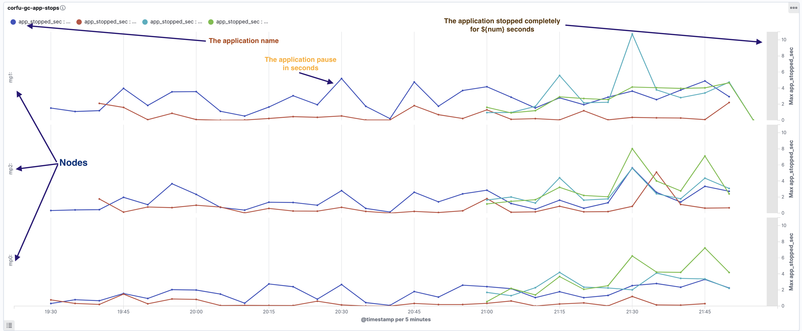
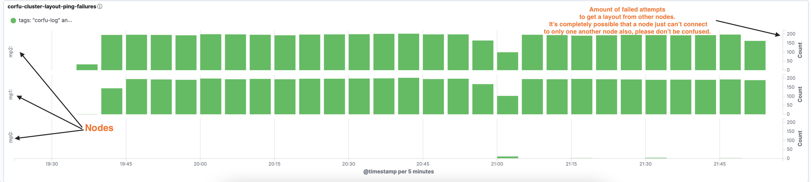
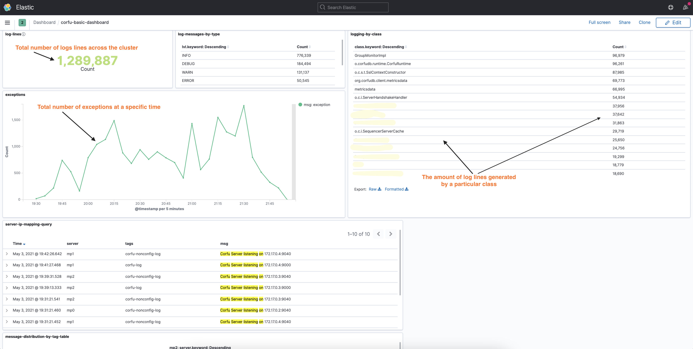
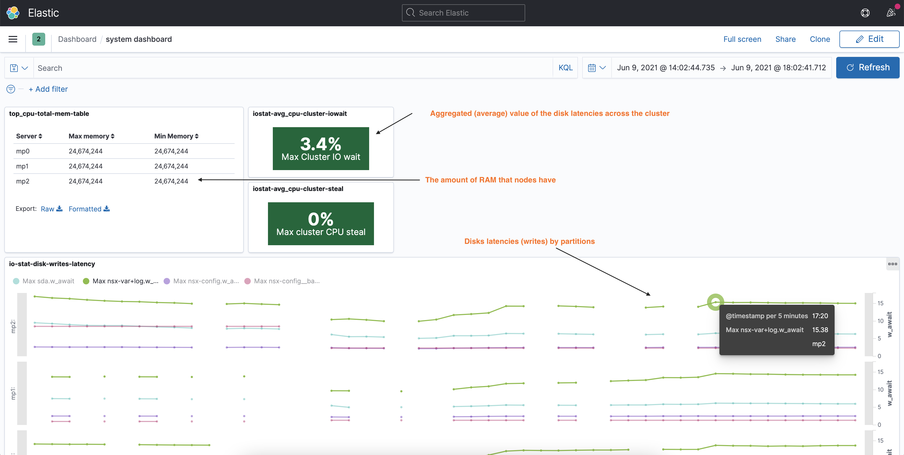

## The Log Aggregation Platform

The Corfu log aggregation platform built on top of [the ELK Stack](https://www.elastic.co/what-is/elk-stack).

**What is the ELK Stack?** "ELK" is the acronym for three open source projects: Elasticsearch, Logstash, and Kibana.
- Elasticsearch is a search and analytics engine.
- Logstash is a server‑side data processing pipeline that ingests data from multiple sources simultaneously,
  transforms it, and then sends it to a "stash" like Elasticsearch.
- Kibana lets users visualize data from Elasticsearch with charts and graphs.

### The platform features
- Automation tools to download, unpack and load the log data from log archives.
- Fast requests, a query language and visualization dashboards, provide high quality user experience.
- A scalable solution that can be extended and customized, highly automated.

### Visualization
Kibana provides powerful and flexible UI and QueryEngine.

Basic Kibana UI :

Kibana multiple filters with custom date range

### Corfu Dashboards

#### Corfu-Cluster-State dashboard
  The dashboard shows overall corfu cluster state.

 The first level shows aggregated statistics of corfu cluster:
 - _corfu-cluster-failures_ table shows how many times corfu cluster detected failures. This also means how many times the layout
   was updated. If there are many updates per short time interval, then the system experiences some problems/outages. 
   That not necessary means that CorfuDb experience problems, but it also could be Vm issues, network issues and so on.  
   
  
 - _corfu-cluster-failure-detection-by-node-chart_ table shows how many times each node detected a failure in the cluster.
   Each node in the cluster can detect a failure and add a failed node in the unresponsive list in the layout.
   
  
 - _corfu-cluster-connection-errors-table_ shows how many times nodes experienced connection issues, how many times
   the node couldn't connect to (an)other nodes.
   

 - _corfu-jvm-app-stops-table_ shows JMV application pauses. 
   It shows for how long each jvm process on each node has been completely stopped, which is an indicator of a quite
   serious issue. The problem could be that the JVM consumed all the memory and get frozen for some time, or the JVM
   can't allocate any resources to continue working, it could be an indication of huge disk latency or the process 
   can't get any CPU time. 
   
   

 - _corfu-log-messages-graph_ shows how many Corfu logs messages had written into the log files on each node. 
   The chart just for information purposes, it shows when Corfu is active and how actively Corfu writing to the log.
   
 
 - _corfu-cluster-failure-detection-chart_ visualizes when and how many times particular node detected a failure 
   and updated the layout. 
   
   
 - _corfu-gc-app-stops_ shows GC app_stops for all JVM-s running on a machine.
   
   
 - _corfu-layout-ping-failures_ shows how many connection issues are present between corfu server nodes
   

 
 

##### The Corfu Basic Dashboard 
  The dashboard provides common information about the corfu cluster,
  like the total amount of log lines, how many records on each log level,
  how much of the log data is generated by the classes, total number of exceptions in the log.

 
 

#### The System Dashboard
 Shows system information about the system: io stats (including disk latencies, io waits), memory usage, disk usage,
 CPU utilization, Load Averages.

 
 
 

Authors:
- **Viacheslav Petc**
- **Pavel Zaytsev**