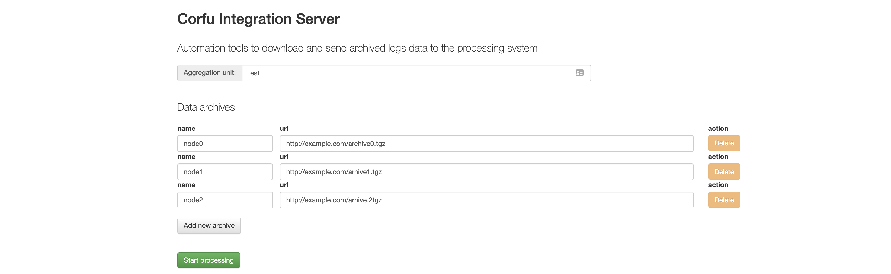
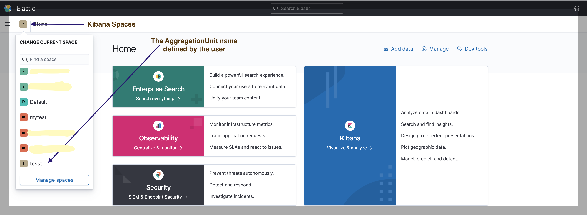

### Logs Processing
    
Log Aggregation Platform provides a web dashboard (**Log Aggregation Server**) which helps to parse and upload logs into 
[ELK](https://www.elastic.co/elastic-stack).
To upload data into ELK, some data archives (support bundles) needs to be provided, the archive must be .tgz file and
has to contain logs in `/var/log` directory, for instance `/var/log/corfu/corfu.9000.log`

The aggregation server will download the archives and starts data processing by running 
[filebeat data collectors](https://www.elastic.co/beats/filebeat)
You just need to define an `aggregation unit` name, which is a name that is used to create all
required indexes and names in ELK stack, and the name will be used to provide a `kibana space`
to separate user's data from the others and provide dashboards related to the user's data.



The aggregation server will provide a status page (JSON) after the user clicks on `start processing`.
At the time when the processing is done the latest message will be `Done`, which signaling that the process is completed, 
and a user can use kibana.

### Status Page
<details><summary>The status page will be similar to the one below</summary>
<p>

```json
{
  "result" : [ {
    "key" : {
      "aggregationUnit" : "test",
      "timestamp" : 1623919171788,
      "date" : "2021-06-17T08:39:31.788Z"
    },
    "message" : "Init processing"
  }, {
    "key" : {
      "aggregationUnit" : "test",
      "timestamp" : 1623919171789,
      "date" : "2021-06-17T08:39:31.789Z"
    },
    "message" : "Download archive: http://example.com/archive0.tgz"
  }, {
    "key" : {
      "aggregationUnit" : "test",
      "timestamp" : 1623919175765,
      "date" : "2021-06-17T08:39:35.765Z"
    },
    "message" : "start unarchive process"
  }, {
    "key" : {
      "aggregationUnit" : "test",
      "timestamp" : 1623919177427,
      "date" : "2021-06-17T08:39:37.427Z"
    },
    "message" : "Unzip logs: /data/test/node0/var/log/corfu"
  }, {
    "key" : {
      "aggregationUnit" : "test",
      "timestamp" : 1623919177527,
      "date" : "2021-06-17T08:39:37.527Z"
    },
    "message" : "Unzip file: /data/test/node0/var/log/policy/corfu-metrics.6.log.gz"
  }, {
    "key" : {
      "aggregationUnit" : "test",
      "timestamp" : 1623919177622,
      "date" : "2021-06-17T08:39:37.622Z"
    },
    "message" : "Unzip file: /data/test/node0/var/log/policy/corfu-metrics.2.log.gz"
  }, {
    "key" : {
      "aggregationUnit" : "test",
      "timestamp" : 1623919177914,
      "date" : "2021-06-17T08:39:37.914Z"
    },
    "message" : "Unzip file: /data/test/node0/var/log/policy/corfu-metrics.5.log.gz"
  }, {
    "key" : {
      "aggregationUnit" : "test",
      "timestamp" : 1623919179398,
      "date" : "2021-06-17T08:39:39.398Z"
    },
    "message" : "Unarchive - completed. Step 2 of 4 finished"
  }, {
    "key" : {
      "aggregationUnit" : "test",
      "timestamp" : 1623919179418,
      "date" : "2021-06-17T08:39:39.418Z"
    },
    "message" : "Execute transformation: TransformConfig(path=var/log/corfu, commands=[sed -i '/handleTrimMarkRequest:/d' corfu.*log, sed -i '/log write:/d' corfu.*log, sed -i '/rangeWrite:/d' corfu.*log, sed -i '/propose: Successful/d' corfu.*log, sed -i '/prepare: Successful/d' corfu.*log])"
  }, {
    "key" : {
      "aggregationUnit" : "test",
      "timestamp" : 1623919179988,
      "date" : "2021-06-17T08:39:39.988Z"
    },
    "message" : "Transformation completed: "
  }, {
    "key" : {
      "aggregationUnit" : "test",
      "timestamp" : 1623919180281,
      "date" : "2021-06-17T08:39:40.281Z"
    },
    "message" : "Transformation completed: "
  }, {
    "key" : {
      "aggregationUnit" : "test",
      "timestamp" : 1623919180480,
      "date" : "2021-06-17T08:39:40.480Z"
    },
    "message" : "Transformation completed: "
  }, {
    "key" : {
      "aggregationUnit" : "test",
      "timestamp" : 1623919180674,
      "date" : "2021-06-17T08:39:40.674Z"
    },
    "message" : "Transformation completed: "
  }, {
    "key" : {
      "aggregationUnit" : "test",
      "timestamp" : 1623919180867,
      "date" : "2021-06-17T08:39:40.867Z"
    },
    "message" : "Execute transformation: TransformConfig(path=var/log/corfu-nonconfig, commands=[sed -i '/handleTrimMarkRequest:/d' corfu.*log, sed -i '/log write:/d' corfu.*log, sed -i '/rangeWrite:/d' corfu.*log, sed -i '/propose: Successful/d' corfu.*log, sed -i '/prepare: Successful/d' corfu.*log])"
  }, {
    "key" : {
      "aggregationUnit" : "test",
      "timestamp" : 1623919180931,
      "date" : "2021-06-17T08:39:40.931Z"
    },
    "message" : "Transformation completed: "
  }, {
    "key" : {
      "aggregationUnit" : "test",
      "timestamp" : 1623919180998,
      "date" : "2021-06-17T08:39:40.998Z"
    },
    "message" : "Transformation completed: "
  }, {
    "key" : {
      "aggregationUnit" : "test",
      "timestamp" : 1623919181062,
      "date" : "2021-06-17T08:39:41.062Z"
    },
    "message" : "Transformation completed: "
  }, {
    "key" : {
      "aggregationUnit" : "test",
      "timestamp" : 1623919181127,
      "date" : "2021-06-17T08:39:41.127Z"
    },
    "message" : "Transformation completed: "
  }, {
    "key" : {
      "aggregationUnit" : "test",
      "timestamp" : 1623919181188,
      "date" : "2021-06-17T08:39:41.188Z"
    },
    "message" : "Start to load archive: node0"
  }, {
    "key" : {
      "aggregationUnit" : "test",
      "timestamp" : 1623919203446,
      "date" : "2021-06-17T08:40:03.446Z"
    },
    "message" : "Loading completed. Step 3 of 4 finished"
  }, {
    "key" : {
      "aggregationUnit" : "test",
      "timestamp" : 1623919203597,
      "date" : "2021-06-17T08:40:03.597Z"
    },
    "message" : "deploying kibana dashboards"
  }, {
    "key" : {
      "aggregationUnit" : "test",
      "timestamp" : 1623919216039,
      "date" : "2021-06-17T08:40:16.039Z"
    },
    "message" : "Done"
  } ]
}
```
</p>
</details>

### Kibana Dashboard
Kibana will provide a `kibana space` (with the name equals to `AggregationUnit`) once the operation is completed.

