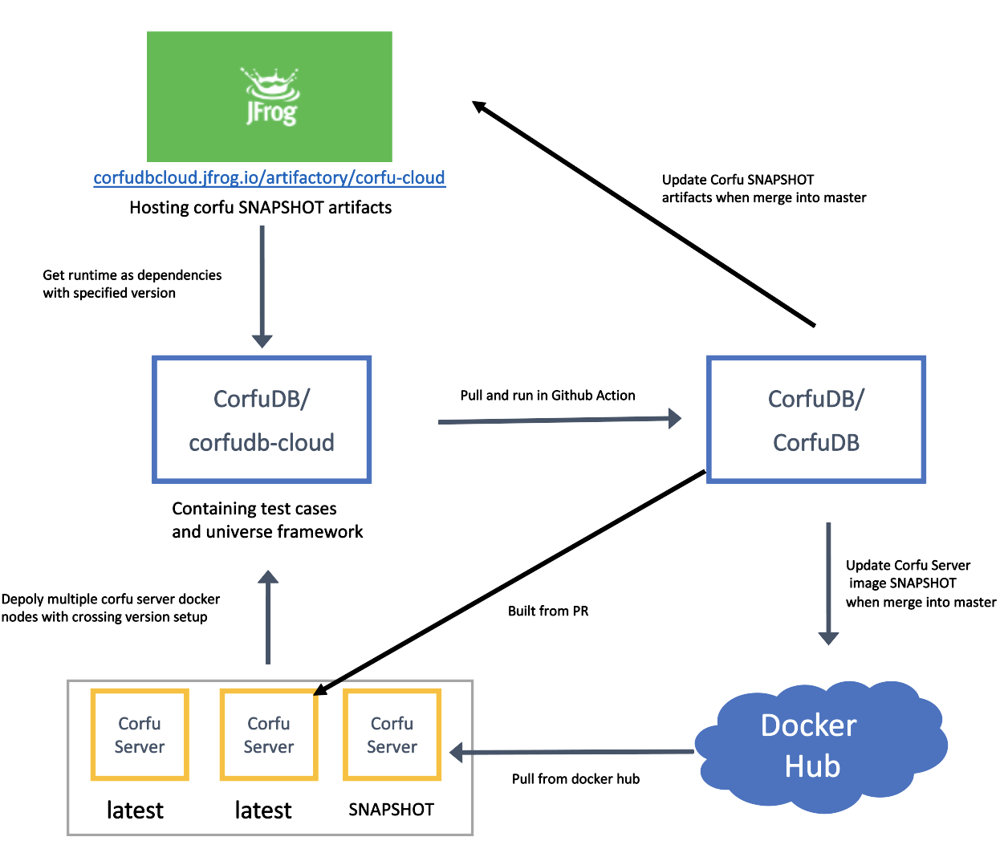

# Version Compatibility Tests
##  Motivation
The changes we made for <b>CorfuSourceCodeVersion</b> and <b>CompatibilityVector</b> are providing plumbings for the future breaking change, i.e., those changes that will break the backward compatibility in Corfu and thus the rolling upgrade guarantee in NSX. Therefore, we want a way to run tests in cross version environment and dynamically detect breaking changes in new Pull Requests.

##  Default Setup
The default setup refers to what we use in the compatibility test action we created at CorfuDB's Github Action, which becomes gating tests for new Pull Requests. This setup could be changed and customized locally, which will be discussed later.

* corfudb-cloud repo contains universe framework for dynamically deploying multi version Corfu server docker containers, and the test cases themselves. CorfuRuntime artifacts are used as dependencies from CorfuDB GitHub Packages.
* We have 2 different version tags in default setup:
    1. SNAPSHOT: artifacts or Corfu server docker images built from last commit in master branch
    2.latest: Corfu server docker image built from TOT of each Pull Request
* By default, in compatibility tests, we create a 3-node Corfu server cluster with 2 different versions, and client side version is SNAPSHOT, like the image below describes:


##  Workflow
The diagram below describes the compatibility test action in CorfuDB, which is running for each Pull Request.

1. Build latest version of Corfu server docker image locally, and pull down SNAPSHOT version of Corfu server docker image from Docker Hub.
2. Pull down the corfudb-cloud repo directly.
3. corfudb-cloud fetches SNAPSHOT version of client side artifacts from GitHub Packages
3. Run the test cases in corfudb-cloud that are tagged with version-compatibility
5. When the new Pull Request is merged into master, we automatically updates the GitHub Packages artifacts and Corfu server image in Docker Hub. (i.e., the SNAPSHOT version is updated)

<b>NOTE</b>: We have deprecated our JFrog cloud repository and moved our artifacts hosting to GitHub Packages, so please ignore the url with JFrog in the diagram.


## Local Testing and Setup Customization
The basic idea is instead of using cloud hosted Corfu client/server versions, we use the specific versions build locally.

1. Prepare Corfu server docker image(s):
    * In CorfuDB repo, switch to the version (git branch/commit) you want, change the version tag specified in pom file (0.4.0-SNAPSHOT for example), run prepare corfu docker image:
    ```shell script
    ./mvnw clean install -Pdocker -DskipTests -Dmaven.javadoc.skip=true -Dcheckstyle.skip -T 1C
    ```
    * Repeat step a with different version tags if you want. Remember to record the version tag you used, which will be needed later.
2. Download corfudb-cloud repo:
    * Run git clone https://github.com/CorfuDB/corfudb-cloud.git to another directory
    * Comment out these lines in corfudb-cloud/gradle/dependencies.gradle, to prevent it from getting artifacts from cloud:
    ```groovy
    maven {
        name = "GitHubPackages"
        url = uri("https://maven.pkg.github.com/corfudb/corfudb")
        // For accessing GitHub Secrets in CorfuDB repo
        credentials {
            username = System.getenv("PKG_USERNAME")
            password = System.getenv("PUBLISH_TOKEN")
        }
    }
    ```
    * Clean gradle and maven local repo by running the command below, ignore File Not Found error if there are any.
    ```shell script
    rm -r ~/.m2/repository/org/corfudb && rm -r ~/.gradle/caches/modules-2/files-2.1/org.corfudb
   ```

    * Go to corfudb-cloud/universe directory, build universe-core and universe- infrastructure to maven local:

    ```shell script
    ./gradlew clean publishToMavenLocal
   ```

3. Prepare Corfu client side artifacts:

    * Go to CorfuDB repo, switch to the version (git branch/commit) you want, change the version tag specified in pom file, run maven install:
     ```shell script
    ./mvnw clean install -DskipTests -T 1C
    ```

4. Run compatibility tests:

    * Go to corfudb-cloud repo, specify version tags in these files:
        * CorfuRuntime version: corfudb-cloud/gradle/dependencies.gradle, corfuVersion = "{your version tag}"
        * Corfu server version node 1 (primary sequencer): corfudb-cloudtests/src/main/resources/universe-tests.properties, server.version={your version tag}
        * Other Corfu server nodes: corfudb-cloud/tests/src/test/java/org/corfudb/test/AbstractCorfuUniverseTest.java, we specify default 3-node cluster nodes versions in getDefaultCrossVersionCluster method. If you want to create other cluster layouts, you could pass version tag using getContainerParams method to add new nodes to the cluster.
    * Run tests from command line or in IDEA. For command line, go to corfudb-cloud/tests/, and run:
    ```shell script
    ./gradlew clean test -Dtags=version-compatibility
    ```

##  Future Work and Optimizations
* Test cases could be enriched. Currently they are just a basic coverage for RPCs in Corfu.
* More setups or cross version scenarios could be covered. The default setup now might not be comprehensive enough to guard us from breaking changes.
* When test fails, it's no easy for developers to inspect and debug. Some workflows for facilitating the debugging process could be introduced.
